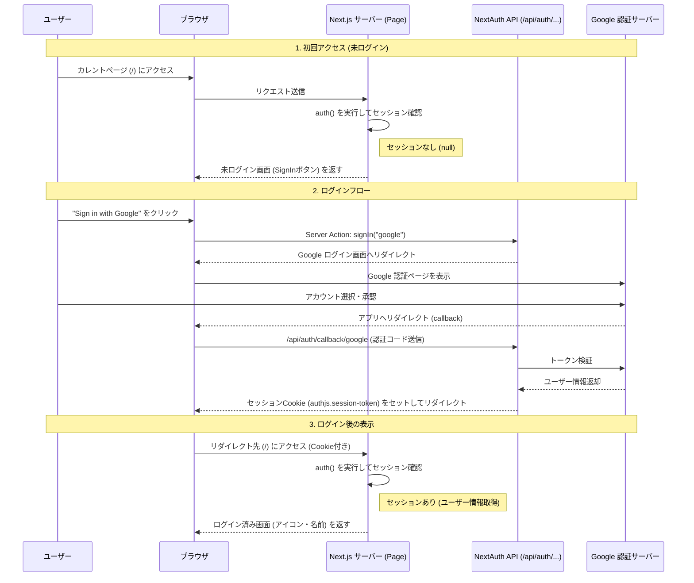

# アプリケーションの動作フロー解説

このプロジェクトのプログラムが、どのように動いているかを解説します。
Next.js (App Router) と NextAuth.js (Auth.js) が連携して認証を行っています。

## 全体像 (アーキテクチャ)

ユーザーがページにアクセスしてから、Google ログインを行い、画面が切り替わるまでの流れです。

## 重要なファイルの役割

プログラムのキーとなるファイルとその役割です。

### 1. 設定と基盤
*   **`auth.ts`**
    *   **役割**: 認証の「司令塔」です。
    *   **内容**: Google を認証プロバイダーとして使うことや、セッションの管理方法が定義されています。ここから `auth`, `signIn`, `signOut` などの便利な関数をエクスポートしています。

*   **`app/api/auth/[...nextauth]/route.ts`**
    *   **役割**: 認証の「窓口」となる API ルートです。
    *   **内容**: `/api/auth/signin` や `/api/auth/callback/google` といった URL へのアクセスを、自動的に `NextAuth` の処理に繋ぎます。Google から「認証OK」という返事が返ってくるのもここです。

*   **`.env.local`**
    *   **役割**: 「鍵」の保管場所です。
    *   **内容**: Google を操作するための ID やパスワード、暗号化用の秘密鍵 (`AUTH_SECRET`) が入っています。

### 2. 画面とアクション
*   **`app/page.tsx` (サーバーコンポーネント)**
    *   **役割**: メインの画面を作ります。サーバー側で動きます。
    *   **処理**:
        1. `await auth()` を呼び出して、「今この人ログインしてる？」と確認します。
        2. ログインしていれば「ユーザー情報」と「ログアウトボタン」を表示。
        3. していなければ「ログインボタン」を表示。
        この分岐を HTML として作ってブラウザに送ります。

*   **`components/auth-components.tsx` (クライアントコンポーネント)**
    *   **役割**: ボタンの部品です。
    *   **処理**: ボタンが押されたときに、`auth.ts` からインポートした `signIn` や `signOut` というサーバー側のアクション (Server Actions) を呼び出します。これにより、画面の再読み込みなしでスムーズに認証処理が始まります。

## 処理の流れまとめ

1. **アクセス時**: `page.tsx` がサーバーで動き、`auth()` で状態チェック。
2. **操作時**: ボタンを押すと `auth-components.tsx` が `auth.ts` の機能を呼び出し、`route.ts` を経由して Google と通信。
3. **完了時**: クッキーがセットされ、`page.tsx` が再度サーバーで動くと、今度は `auth()` がユーザー情報を返すので画面が変わる。
