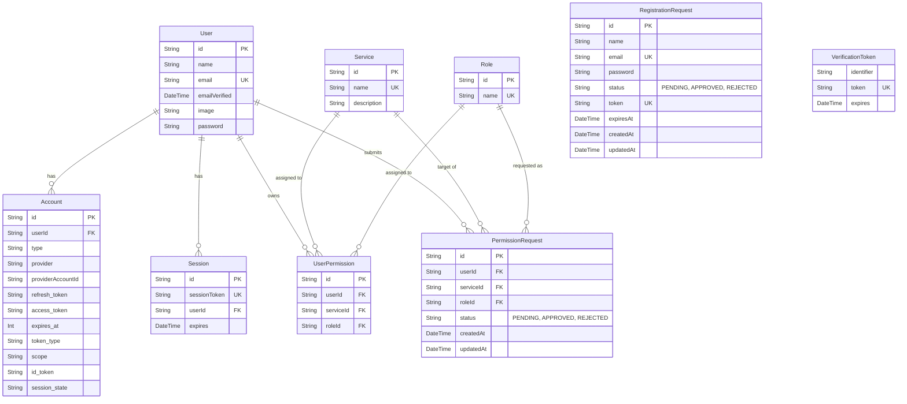

# データベース設計書 (Table Definitions)

このドキュメントでは、本プロジェクトで使用されている SQLite データベースのテーブル定義について記述します。

## ER図 (Entity Relationship Diagram)

## テーブル詳細

### 1. User (ユーザー)
認証されたユーザー情報を保持します。NextAuth の標準テーブルを拡張しています。

| カラム名 | 型 | 制約 | 説明 |
| :--- | :--- | :--- | :--- |
| id | String | PK, cuid() | ユーザーID |
| name | String? | | 氏名 |
| email | String? | Unique | メールアドレス |
| emailVerified | DateTime? | | メール確認日時 |
| image | String? | | プロフィール画像URL |
| password | String? | | ハッシュ化されたパスワード (Credentials用) |

### 2. RegistrationRequest (アカウント登録申請)
新規ユーザー登録の承認待ちデータを保持します。

| カラム名 | 型 | 制約 | 説明 |
| :--- | :--- | :--- | :--- |
| id | String | PK, cuid() | 申請ID |
| name | String | | 氏名 |
| email | String | Unique | メールアドレス |
| password | String | | ハッシュ化されたパスワード |
| status | String | Default: "PENDING" | 状態 (PENDING, APPROVED, REJECTED) |
| token | String? | Unique | 本登録用メールトークン |
| expiresAt | DateTime? | | トークン有効期限 |

### 3. Service (サービス)
権限管理の対象となる各システムや機能のマスターデータです。

| カラム名 | 型 | 制約 | 説明 |
| :--- | :--- | :--- | :--- |
| id | String | PK, cuid() | サービスID |
| name | String | Unique | サービス名 (例: 在庫管理, 人事システム) |
| description | String? | | サービスの説明 |

### 4. Role (ロール)
サービス内での役割を定義するマスターデータです。

| カラム名 | 型 | 制約 | 説明 |
| :--- | :--- | :--- | :--- |
| id | String | PK, cuid() | ロールID |
| name | String | Unique | ロール名 (例: 一般, 管理者, システム管理者) |

### 5. UserPermission (ユーザー権限)
ユーザーがどのサービスに対してどのロールを持っているかを管理する中間テーブルです。

| カラム名 | 型 | 制約 | 説明 |
| :--- | :--- | :--- | :--- |
| id | String | PK, cuid() | 権限ID |
| userId | String | FK (User.id) | ユーザーID |
| serviceId | String | FK (Service.id) | サービスID |
| roleId | String | FK (Role.id) | ロールID |

*複合ユニーク制約*: `[userId, serviceId]` により、1ユーザー1サービスにつき1つのロールのみ保持します。

### 6. PermissionRequest (権限利用申請)
ユーザーからのサービス利用申請を管理します。

| カラム名 | 型 | 制約 | 説明 |
| :--- | :--- | :--- | :--- |
| id | String | PK, cuid() | 申請ID |
| userId | String | FK (User.id) | 申請者ID |
| serviceId | String | FK (Service.id) | 対象サービスID |
| roleId | String | FK (Role.id) | 申請ロールID |
| status | String | Default: "PENDING" | 状態 (PENDING, APPROVED, REJECTED) |

### その他 (NextAuth 標準テーブル)
- **Account**: 外部プロバイダ (Google等) との連携情報
- **Session**: セッション情報
- **VerificationToken**: NextAuth 標準の確認トークン
