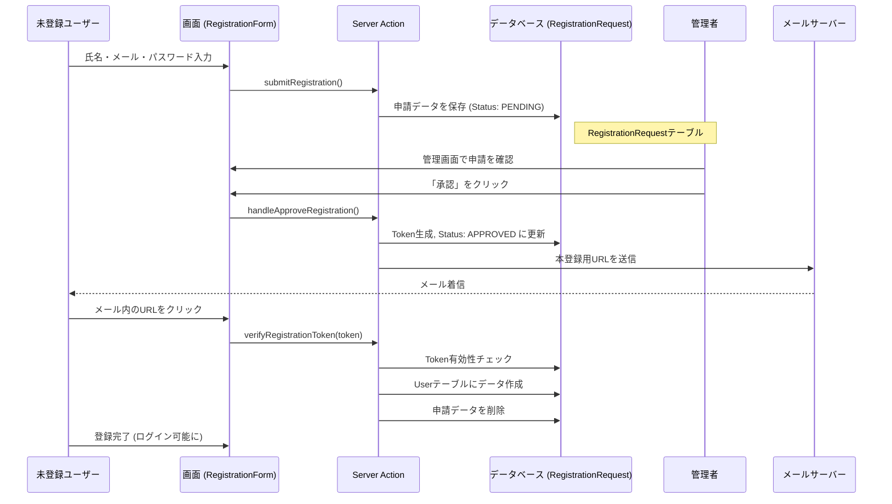
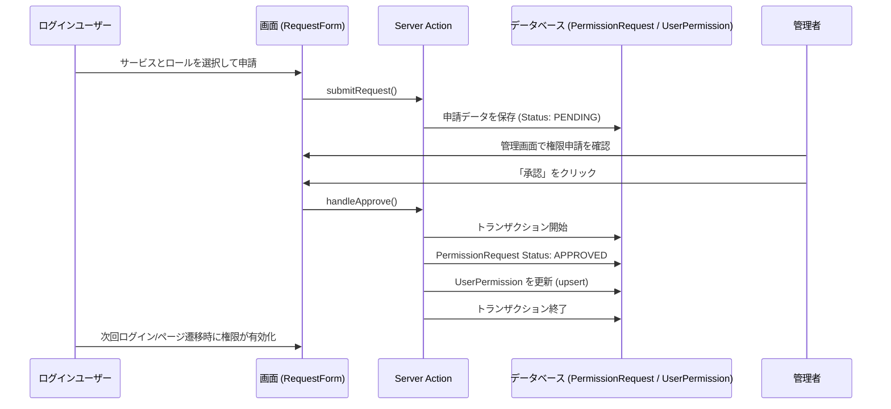
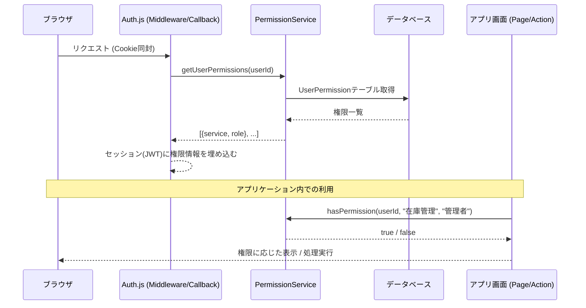

# システムフロー (System Flows)

本プロジェクトにおける主要な業務フローについて解説します。

## 1. アカウント登録フロー (Account Registration)

新規ユーザーがアカウントを作成し、管理者が承認するまでの流れです。

## 2. 権限利用申請フロー (Permission Request)

ログイン済みユーザーが、特定のサービスの権限（ロール）を申請する流れです。

## 3. 認証・認可フロー (Auth & Authorization)

NextAuth によるセッション管理と、取得した権限情報の利用フローです。

